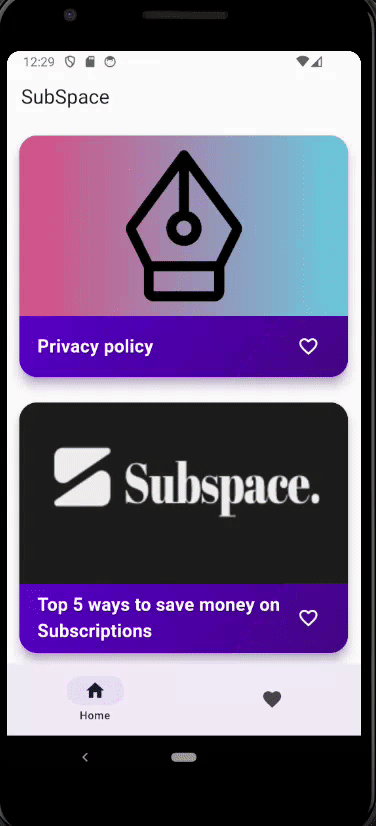
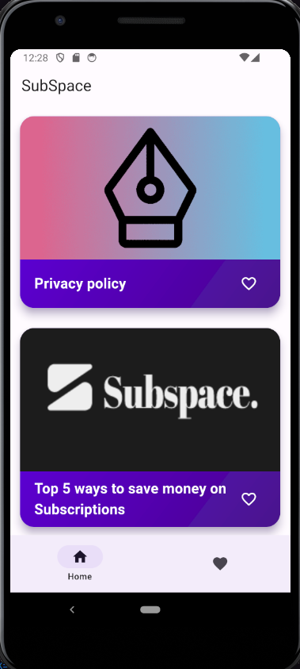
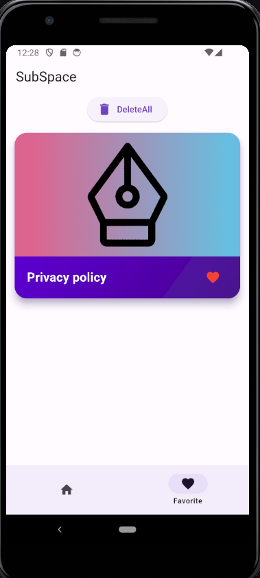

# Flutter Blog App

A Flutter application for managing and displaying a list of blogs with the ability to mark blogs as favorites. This project utilizes Hive for local data persistence and Riverpod for state management.

## Features

- View a list of blogs.
- Mark blogs as favorites.
- View a separate page for favorite blogs.
- Offline support using Hive for local storage.

## Getting Started
### Screenshots

<p align="middle"> 
 
  
  
</p>

### Prerequisites

- [Flutter SDK](https://flutter.dev/docs/get-started/install)
- [Dart SDK](https://dart.dev/get-dart)

### Installation

1. Clone the repository:

   ```bash
   git clone https://github.com/yourusername/flutter-blog-app.git
   ```

2. Navigate to the project folder:

   ```bash
   cd flutter-blog-app
   ```

3. Install dependencies:

   ```bash
   flutter pub get
   ```

### Usage

Run the app using:

```bash
flutter run
```

The app should open on your device or simulator.

### Folder Structure

```
|-- lib
|   |-- main.dart
|   |-- models
|   |   |-- blog_model.dart
|   |-- providers
|   |   |-- blog_provider.dart
|   |   |-- favorite_blogs_provider.dart
|   |-- screens
|   |   |-- blog_list_screen.dart
|   |   |-- favorite_blogs_screen.dart
|   |-- services
|   |   |-- blog_service.dart
|   |-- widgets
|   |   |-- blog_card.dart
```


## Contributing

Contributions are welcome! If you find any issues or have suggestions for improvement, please open an issue or create a pull request.

## License

This project is licensed under the MIT License - see the [LICENSE](LICENSE) file for details.
